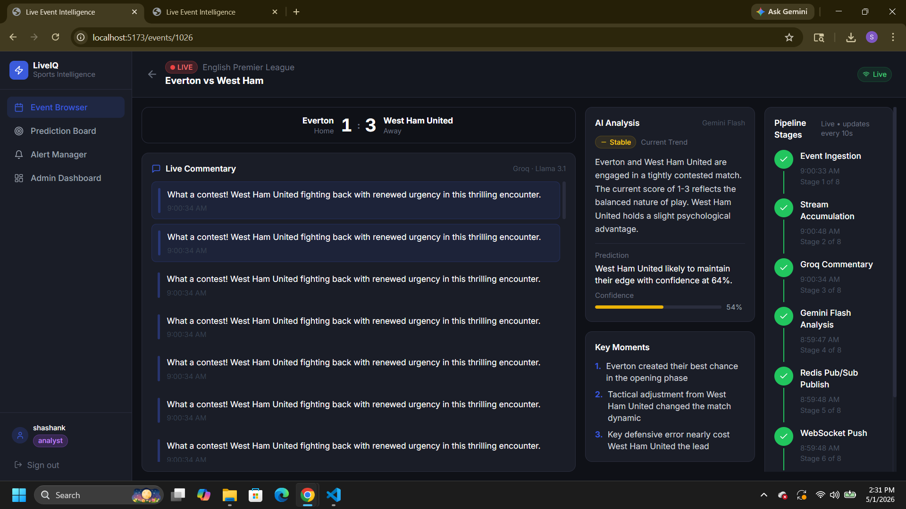
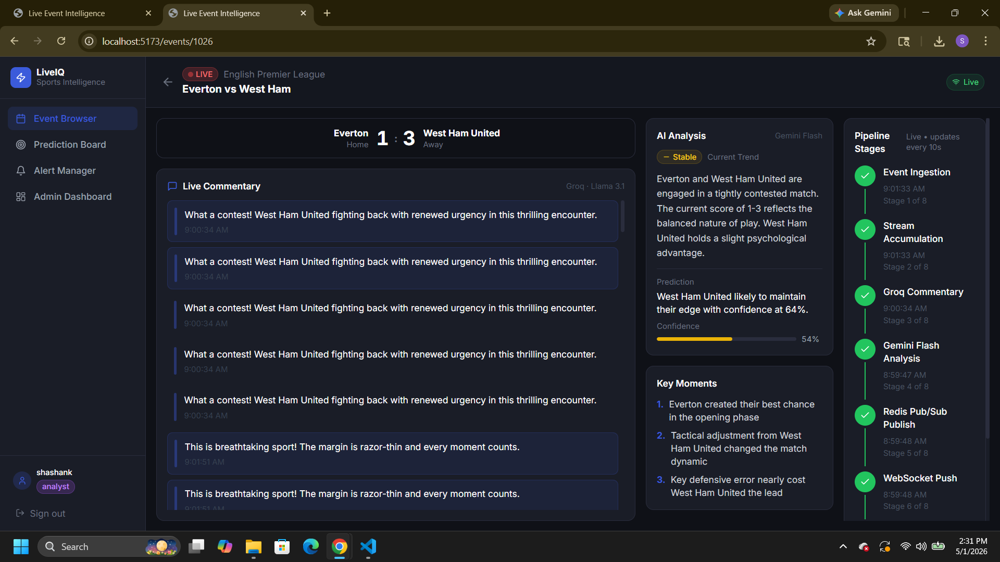

# Live Event Intelligence Platform

A production-grade real-time sports AI platform — Growth Vector AI Engineer Intern Assignment 5.

## Architecture Overview

```
┌─────────────────────────────────────────────────────────────────┐
│                        Frontend (React + Vite)                   │
│   Auth │ Event Browser │ Live View │ Analysis │ Alerts │ Admin   │
└───────────────────────────┬─────────────────────────────────────┘
                            │ HTTP + WebSocket
┌───────────────────────────▼─────────────────────────────────────┐
│                     FastAPI Backend (Python)                      │
│  JWT Auth │ REST API │ WebSocket │ APScheduler │ Internal API     │
└─────────┬────────────────────────────────────┬───────────────────┘
          │                                    │
          │ Redis Pub/Sub                       │ SQLite DB
┌─────────▼──────────┐              ┌──────────▼──────────────────┐
│       Redis         │              │         SQLite               │
│  Pub/Sub channels   │              │  users, sport_events,        │
│  WS cache (last 10) │              │  event_stream, analyses,     │
│  BullMQ job store   │              │  pipeline_stages, alerts,    │
└─────────┬──────────┘              │  event_reports, ai_call_logs │
          │                         └─────────────────────────────-┘
┌─────────▼──────────────────────────────────────────────────────┐
│                  BullMQ Workers (Node.js)                        │
│                                                                  │
│  ┌──────────┐ ┌─────────────┐ ┌───────────┐ ┌───────────────┐  │
│  │Ingestion │ │Accumulation │ │Commentary │ │   Analysis    │  │
│  │ Stage 1  │ │   Stage 2   │ │  Stage 3  │ │   Stage 4-6   │  │
│  └──────────┘ └─────────────┘ └───────────┘ └───────────────┘  │
│  ┌──────────┐ ┌─────────────┐                                   │
│  │  Alert   │ │   Report    │   Bull Board: /admin/queues        │
│  │ Stage 7  │ │   Stage 8   │                                   │
│  └──────────┘ └─────────────┘                                   │
└────────────────────────────────────────────────────────────────┘
          │                    │
  ┌───────▼──────┐    ┌────────▼──────┐
  │ Groq API     │    │ Gemini API    │
  │ Llama 3.1 8B │    │ 1.5 Flash     │
  │ <2s latency  │    │ Deep analysis │
  └──────────────┘    └───────────────┘
```

## 8-Stage Pipeline

| Stage | Name | Implementation |
|-------|------|---------------|
| 1 | Event Ingestion | APScheduler (60s) → BullMQ → TheSportsDB/mock |
| 2 | Stream Accumulation | Rolling 50-event window in SQLite |
| 3 | Groq Commentary | Llama 3.1 8B, <2s, 60s debounce per event |
| 4 | Gemini Flash Analysis | Every 5 min, structured JSON output |
| 5 | Redis Pub/Sub | Publish to `event:{id}:updates` channel |
| 6 | WebSocket Push | All subscribed clients, catchup on reconnect |
| 7 | Alert Rule Evaluation | keyword / score_threshold / trend_change |
| 8 | Post-Event Report | Gemini narrative + prediction accuracy review |

## Quick Start

### Prerequisites
- Docker + Docker Compose
- Node.js 20+ (for local worker dev)
- Python 3.11+ (for local backend dev)

### 1. Clone and configure

```bash
git clone <your-repo-url>
cd live-event-intelligence
cp .env.example .env
# Edit .env — add GROQ_API_KEY and GEMINI_API_KEY
```

### 2. Run with Docker Compose

```bash
docker compose up --build
```

Services:
- **Frontend**: http://localhost:5173
- **Backend API**: http://localhost:8000
- **API Docs**: http://localhost:8000/docs
- **Bull Board**: http://localhost:3001/admin/queues
- **Redis**: localhost:6379

### 3. Run locally (without Docker)

**Start Redis:**
```bash
docker run -d -p 6379:6379 redis
```

**Backend:**
```bash
cd backend
pip install -r requirements.txt
cp ../.env.example .env
uvicorn app.main:app --reload --port 8000
```

**Workers:**
```bash
cd workers
npm install
cp ../.env.example .env
node src/index.js
```

**Frontend:**
```bash
cd frontend
npm install
npm run dev
```

## Environment Variables

| Variable | Required | Description |
|----------|----------|-------------|
| `GROQ_API_KEY` | Yes | From console.groq.com — free tier |
| `GEMINI_API_KEY` | Yes | From aistudio.google.com — free tier |
| `JWT_SECRET` | Yes | Long random string for token signing |
| `USE_MOCK` | No | `true` = use mock_livescore.json (default: true) |
| `REDIS_URL` | No | Redis connection string (default: redis://localhost:6379) |
| `DATABASE_URL` | No | SQLite path (default: sqlite+aiosqlite:///./data/events.db) |
| `THESPORTSDB_API_KEY` | No | Use `123` for free dev tier |
| `BACKEND_URL` | No | For worker→backend calls (default: http://localhost:8000) |

## Getting Free API Keys

| Service | URL | Limit |
|---------|-----|-------|
| Groq (Llama 3.1 8B) | console.groq.com → Sign up → API Keys | 14,400 req/day |
| Gemini 1.5 Flash | aistudio.google.com → Get API Key | 15 req/min, 1M tokens/day |
| TheSportsDB | Use key `123` for dev | Free past events |

## 8 Required Screens

| # | Screen | Route |
|---|--------|-------|
| 01 | Sign Up / Login | `/login` |
| 02 | Event Browser | `/events` |
| 03 | Live Event View ★ | `/events/:id` |
| 04 | AI Analysis Panel | `/events/:id/analysis` |
| 05 | Prediction Board | `/predictions` |
| 06 | Alert Manager | `/alerts` (Analyst only) |
| 07 | Post-Event Report | `/events/:id/report` (Analyst only) |
| 08 | Admin Dashboard | `/admin` (Analyst only) |

★ Screen 03 is the most important — it shows the live pipeline stepper, real-time commentary feed, Gemini analysis panel, and WebSocket status indicator all simultaneously.

## RBAC Roles

| Feature | Viewer | Analyst |
|---------|--------|---------|
| Browse events | ✓ | ✓ |
| Subscribe to events | ✓ (max 3) | ✓ (unlimited) |
| Live event view | ✓ | ✓ |
| Prediction board | ✓ | ✓ |
| Alert rules | ✗ | ✓ (max 5/event) |
| Post-event reports | ✗ | ✓ |
| Admin dashboard | ✗ | ✓ |

## WebSocket Testing (2 Simultaneous Clients)

Open two browser tabs to the same live event:

```
Tab 1: http://localhost:5173/events/1026
Tab 2: http://localhost:5173/events/1026
```

Both clients receive identical real-time updates. On reconnect, the client receives the last 10 cached updates automatically.

**Screenshot of 2 simultaneous clients:**

Tab 1:


Tab 2:


## Alert Rule Types

```json
// keyword_detected — fires when Groq commentary or Gemini analysis contains keyword
{ "rule_type": "keyword_detected", "rule_config": { "keyword": "injury" } }

// score_threshold — fires when score gap reaches or exceeds threshold
{ "rule_type": "score_threshold", "rule_config": { "threshold": 3 } }

// trend_change — fires when Gemini detects specified trend
{ "rule_type": "trend_change", "rule_config": { "trend": "reversal" } }
```

## Bull Board

The BullMQ visual dashboard is available at http://localhost:3001/admin/queues

Queues visible:
- `ingestion` — event polling jobs (every 60s)
- `accumulation` — stream window maintenance
- `commentary` — Groq fast commentary
- `analysis` — Gemini deep analysis (every 5 min)
- `alert-rules` — rule evaluation after each analysis
- `report` — post-event report generation

## Bonus Challenges Implemented

### ✅ Bonus 1: Weather Injection
Uses Open-Meteo API (free, no key required) to inject real venue weather conditions into Gemini analysis prompts.

**Endpoint:** `GET /api/weather/{city}`

**How to test:**
1. Open http://localhost:5173 and sign in
2. Open browser DevTools (F12) → Console tab
3. Paste:
```javascript
fetch('http://localhost:8000/api/weather/London',{headers:{Authorization:'Bearer '+localStorage.getItem('token')}}).then(r=>r.json()).then(console.log)
```
4. You'll see live weather data for London injected into Gemini prompts

The weather `prompt_injection` string is automatically included in Gemini analysis calls when the event city matches a known city in our coordinates lookup.

### ✅ Bonus 2: BullMQ Job Retry Dashboard
A live UI panel in the Admin Dashboard showing all failed BullMQ jobs across all 6 queues — with retry count, error message, last attempted timestamp, and a one-click Retry button.

**How it works:**
- Workers expose `GET http://localhost:3001/api/failed-jobs` — returns failed jobs from all queues via BullMQ's Redis data structures
- Workers expose `POST http://localhost:3001/api/retry-job` — requeues a specific failed job
- Admin Dashboard polls every 15s and renders the retry table
- Shows: queue name, job name, attempts/max, error message, last attempt time, Retry button

**How to test:**
1. Go to Admin Dashboard → scroll down to **BullMQ Failed Jobs** panel
2. If all queues are healthy, you'll see "✅ No failed jobs"
3. To force a failure for testing: temporarily set an invalid `GROQ_API_KEY` in `.env`, restart workers, wait 60s, then restore the key
4. Failed jobs appear in the table with a Retry button — click to requeue immediately

**API:**
```bash
# Get all failed jobs
curl http://localhost:3001/api/failed-jobs

# Retry a specific job
curl -X POST http://localhost:3001/api/retry-job \
  -H "Content-Type: application/json" \
  -d '{"queue": "commentary", "jobId": "job-123"}'
```

## Project Structure

```
live-event-intelligence/
├── docker-compose.yml
├── .env.example
├── backend/
│   ├── Dockerfile
│   ├── requirements.txt
│   └── app/
│       ├── main.py                  # FastAPI app entry
│       ├── core/
│       │   ├── config.py            # Pydantic settings
│       │   ├── database.py          # SQLAlchemy async
│       │   ├── security.py          # JWT + RBAC
│       │   └── redis_manager.py     # Pub/Sub + WS manager
│       ├── models/
│       │   ├── user.py              # All SQLAlchemy models
│       │   └── schemas.py           # All Pydantic schemas
│       ├── api/
│       │   ├── auth.py              # /api/auth/*
│       │   ├── events.py            # /api/events/*
│       │   ├── predictions.py       # /api/predictions/*
│       │   ├── alerts.py            # /api/alerts/*
│       │   ├── admin.py             # /api/admin/*
│       │   ├── websocket.py         # /ws/events/:id
│       │   ├── internal.py          # /api/internal/* (worker calls)
│       │   └── weather.py           # /api/weather/* (bonus)
│       └── services/
│           ├── ai_service.py        # Groq + Gemini wrappers
│           ├── sports_service.py    # TheSportsDB + mock loader
│           ├── pipeline_service.py  # Stage tracker
│           └── scheduler.py        # APScheduler tasks
├── workers/
│   ├── Dockerfile
│   ├── package.json
│   ├── mock_livescore.json          # 50 sample events
│   └── src/
│       ├── index.js                 # Entry: starts all workers + Bull Board
│       ├── queues.js                # BullMQ queue definitions
│       └── workers/
│           ├── ingestionWorker.js   # Stage 1
│           ├── accumulationWorker.js# Stage 2
│           ├── commentaryWorker.js  # Stage 3
│           ├── analysisWorker.js    # Stage 4-6
│           ├── alertWorker.js       # Stage 7
│           └── reportWorker.js      # Stage 8
└── frontend/
    ├── Dockerfile
    ├── package.json
    ├── vite.config.js
    ├── tailwind.config.js
    ├── index.html
    └── src/
        ├── main.jsx
        ├── App.jsx                  # Router + protected routes
        ├── index.css
        ├── store/authStore.js       # Zustand auth state
        ├── lib/api.js               # Axios instance
        ├── hooks/
        │   └── useEventWebSocket.js # WS hook with reconnect
        ├── components/
        │   ├── ui/index.jsx         # Shared components
        │   ├── PipelineStepper.jsx  # ★ Live pipeline stepper
        │   └── layout/Layout.jsx    # Sidebar nav
        └── pages/
            ├── AuthPage.jsx         # Screen 01
            ├── EventBrowser.jsx     # Screen 02
            ├── LiveEventView.jsx    # Screen 03 ★
            └── OtherPages.jsx       # Screens 04-08
```

## API Documentation

FastAPI auto-generates interactive docs at:
- **Swagger UI**: http://localhost:8000/docs
- **ReDoc**: http://localhost:8000/redoc

## Common Troubleshooting

**Workers can't reach backend:**
- Ensure backend is running on port 8000
- Check `BACKEND_URL` in `.env`
- Workers wait 15s on boot before first analysis enqueue

**Gemini rate limit hit:**
- 15 req/min is generous for 5-min cadence
- If testing heavily, set `USE_MOCK=true` to avoid API calls
- Check AI Call Log in Admin Dashboard

**WebSocket not connecting:**
- Ensure Redis is running: `docker ps | grep redis`
- Check browser console for WS URL
- Token must be passed as query param: `?token=<jwt>`

**No events showing:**
- Visit `/api/events/refresh` endpoint or click Refresh button
- Events are seeded on backend startup from mock file
- Check `USE_MOCK=true` is set in `.env`
